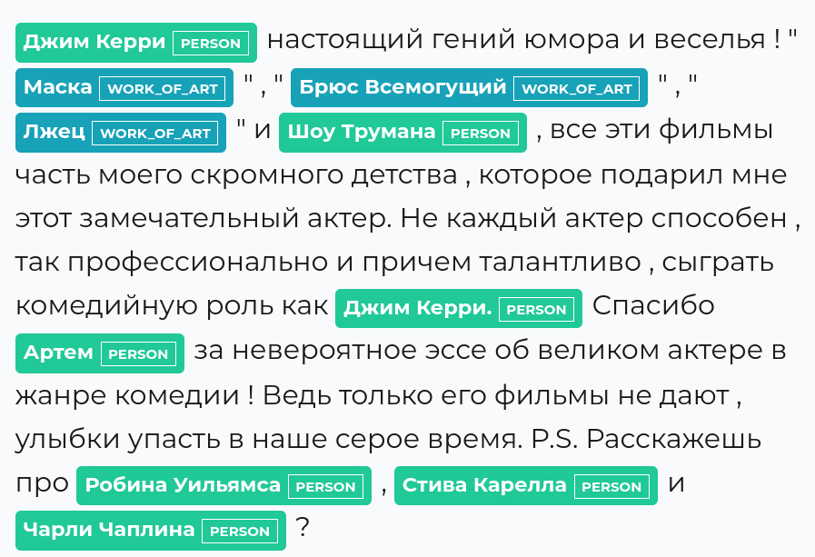
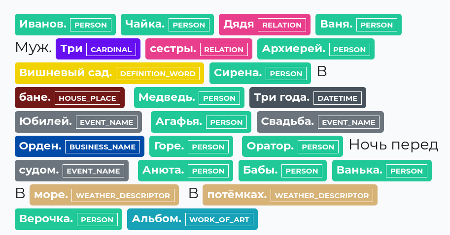
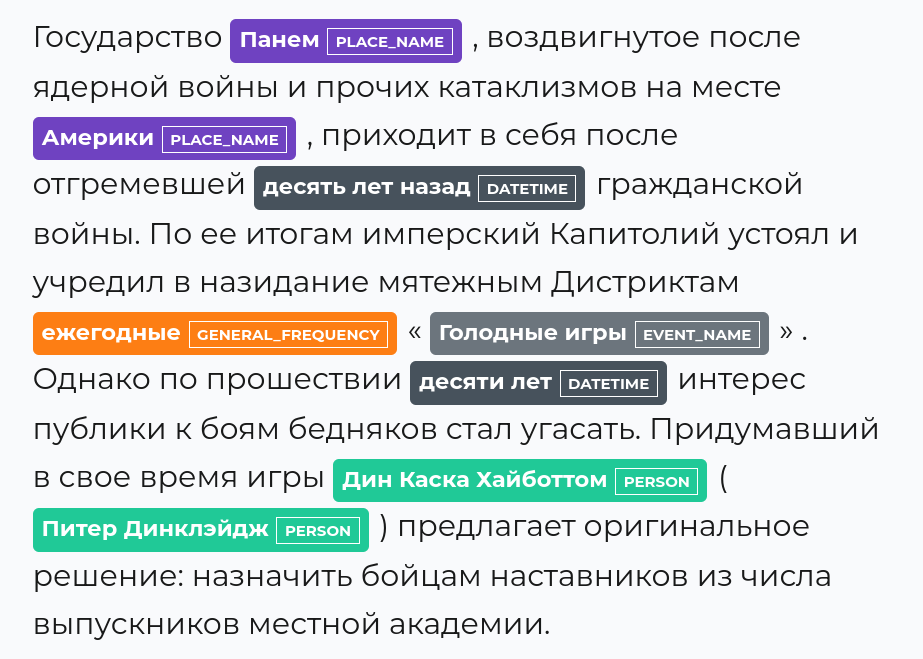
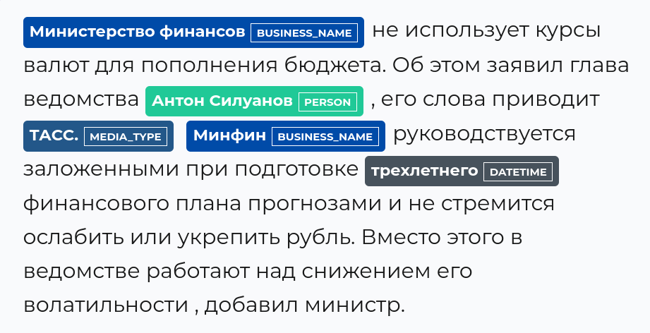
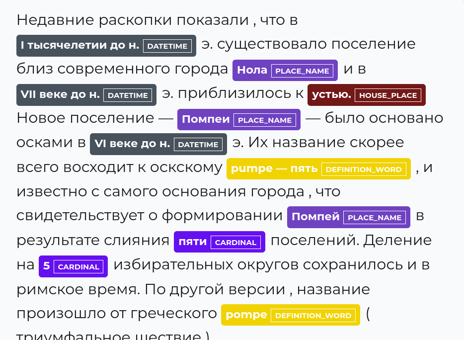
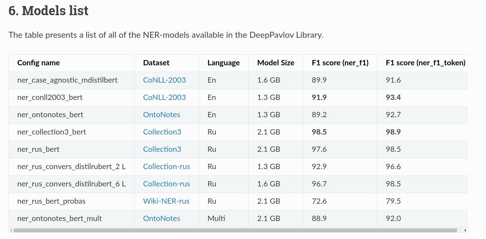
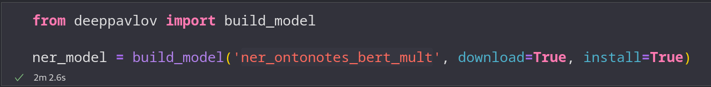
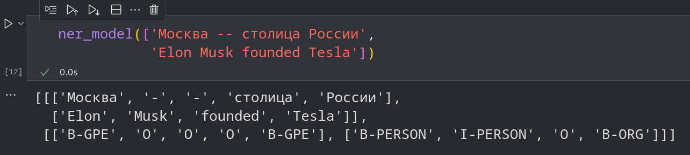

# Задание 1

## Было выбрано 5 текстов

### 1. Комментарий под видео 

```
Джим Керри настоящий гений юмора и веселья!  "Маска", "Брюс Всемогущий", "Лжец" и Шоу Трумана, все эти фильмы часть моего скромного детства, которое подарил мне этот замечательный актер. Не каждый актер способен, так профессионально и причем талантливо, сыграть комедийную роль как Джим Керри. Спасибо Артем за невероятное эссе об великом актере в жанре комедии! Ведь только его фильмы не дают, улыбки упасть в наше серое время. P.S. Расскажешь про Робина Уильямса, Стива Карелла и Чарли Чаплина?
```



Интересно, что модель распознает все, что внутри кавычек, как `WORK_OF_ART`. Если убрать кавычки, то `Маска` будет распознана как `PERSON`. `Шоу Трумана` помечается тегом `PERSON`, снова из-за того что нет кавычек. Остальные сущности определены корректно.

### 2. Стихотворение

```
Иванов.Чайка.Дядя Ваня.
Муж. Три сестры. Архиерей.
Вишневый сад. Сирена. В бане.
Медведь. Три года. Юбилей.
Агафья. Свадьба. Орден. Горе.
Оратор. Ночь перед судом.
Анюта. Бабы. Ванька. В море.
В потёмках. Верочка. Альбом.
...
```

Захотелось сделать так, чтобы модель совершила максимальное количество ошибок, так как не знает контекст. Выше представлено начало стихотворения, которое составлено только из названий произведений А.П.Чехова.


По какой-то причине `Горе`, `Медведь`, `Оратор`, `Бабы` стали именами людей, возможно, это связано с тем, что предложение состоит из единственного слова, так как если заменить `Медведь.` на `Медведь лежал на пригорке.`, то сущность не будет выделена. 
Кроме этого `море` вдруг стало описанием погоды, в остальном модель достаточно хорошо справилась.


### 3. Фрагмент из статьи

```
Государство Панем, воздвигнутое после ядерной войны и прочих катаклизмов на месте Америки, приходит в себя после отгремевшей десять лет назад гражданской войны. По ее итогам имперский Капитолий устоял и учредил в назидание мятежным дистриктам ежегодные «Голодные игры». Однако по прошествии десяти лет интерес публики к боям бедняков стал угасать. Придумавший в свое время игры Дин Каска Хайботтом (Питер Динклэйдж) предлагает оригинальное решение: назначить бойцам наставников из числа выпускников местной академии. 
```


Модель справилась хорошо, однако не выделила `Капитолий` как `PLACE_NAME`, особенно хочется отметить, что `Голодные игры` помечены именно как `EVENT_NAME`, а не как `WORK_OF_ART` (фильм).

### 4. Новости об экономике

```
Министерство финансов не использует курсы валют для пополнения бюджета. Об этом заявил глава ведомства Антон Силуанов, его слова приводит ТАСС.

Минфин руководствуется заложенными при подготовке трехлетнего финансового плана прогнозами и не стремится ослабить или укрепить рубль. Вместо этого в ведомстве работают над снижением его волатильности, добавил министр.
```



Извлеченные сущности помечены верно, но модель никак не пометила `рубль`, хотя тэг `MONEY` заявлен.

### 5. Фрагмент из статьи на Википедии.

```
Недавние раскопки показали, что в I тысячелетии до н. э. существовало поселение близ современного города Нола и в VII веке до н. э. приблизилось к устью. Новое поселение — Помпеи — было основано осками в VI веке до н. э. Их название скорее всего восходит к оскскому pumpe — пять, и известно с самого основания города, что свидетельствует о формировании Помпей в результате слияния пяти поселений. Деление на 5 избирательных округов сохранилось и в римское время. По другой версии, название произошло от греческого pompe (триумфальное шествие).
```



Модель не включает `э.` в дату.
`устью` - это не место в доме.

# Задание 2.

## Установил `deeppavlov`. 
## В нем модель `ner_ontonotes_bert_mult`.





### Результат выполнения: 

